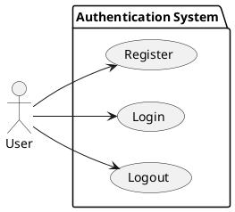

### user authentication use case

```puml
@startuml
left to right direction

actor User as U
package "Authentication System" {
  usecase "Register" as UC1
  usecase "Login" as UC2
  usecase "Logout" as UC3
}

U --> UC1
U --> UC2
U --> UC3

@enduml
```